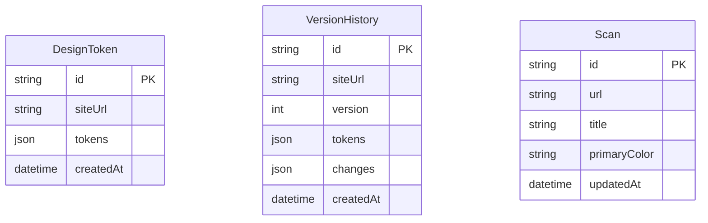

# StyleSync - Architecture Documentation

This document explains the technical architecture, data flow, and design decisions behind **StyleSync**.

## 🏗 High-Level Architecture

StyleSync follows a modern full-stack architecture using Next.js for both the client-side UI and server-side API logic.

### Systems Overview
- **Client (React)**: Interactive dashboard built with Next.js App Router and Tailwind CSS 4.
- **Server (API Routes)**: Node.js environment handling scraping requests and database interactions.
- **Scraper Engine (Puppeteer)**: A headless browser service that performs deep analysis of target websites.
- **Data Persistence (Prisma + PostgreSQL)**: Relational database for storing site metadata, tokens, and version history.

---

## 🔄 Core Workflows

### 1. Token Extraction Pipeline
The extraction process is the heart of the application:
1. **Request**: The user submits a URL via the UI.
2. **Scraping**: The `/api/analyze` route triggers `scrapeWebsite`. Puppeteer launches, navigates to the URL, and executes client-side scripts to extract computed styles (colors, fonts, sizes).
3. **Normalization**: The `tokenExtractor` service processes raw CSS values, converting them into a unified JSON format (e.g., converting all colors to HSL/Hex).
4. **Persistence**: The initial tokens are saved to the `DesignToken` table.
5. **Response**: The structured tokens are returned to the client and loaded into the global state.

### 2. State Management & Persistence
- **Zustand**: Acts as the single source of truth for the active session. This allows components (ColorEditor, TypographyEditor) to stay in sync.
- **Locking Mechanism**: When a token is "locked," it is flagged in the state. Subsequent "re-scans" of the same site will respect these locked values, allowing users to manually refine their design system without losing progress.
- **Version Snapshots**: When a user saves changes, a snapshot of the *entire* token set is saved to the `VersionHistory` table along with a change description.

---

## 🛠 Tech Stack Rationale

### Why Puppeteer?
Standard HTML parsing (like Cheerio) cannot capture **computed styles** or styles defined in shadow DOMs / external JS. Puppeteer allows us to capture exactly what the user sees in the browser.

### Why Zustand?
Zustand provides a minimal, boilerplate-free state management solution that is highly performant. Its ability to be easily integrated with `localStorage` or external DBs makes it perfect for a dashboard-style application.

### Why CSS Variables?
StyleSync normalizes all extracted tokens into CSS variables. This makes the exported tokens immediately "pluggable" into any modern web project, reducing friction for developers.

---

## 📊 Data Model

---

## 🔒 Security Considerations
- **Environment Variables**: Sensitive connection strings are managed via `.env` and never exposed to the client.
- **Input Validation**: All URLs are validated using **Zod** to prevent SSRF (Server-Side Request Forgery) attacks.
- **Rate Limiting**: To prevent abuse of the scraping engine, rate limiting is recommended on the `/api/analyze` endpoint.

---

## 🚀 Deployment Strategy
The application is designed to be hosted on **Vercel**. 
- API routes automatically become serverless functions.
- Puppeteer is configured to run in a headless environment compatible with serverless constraints.
- Database is hosted externally (e.g., Neon) to ensure persistence across deployments.
